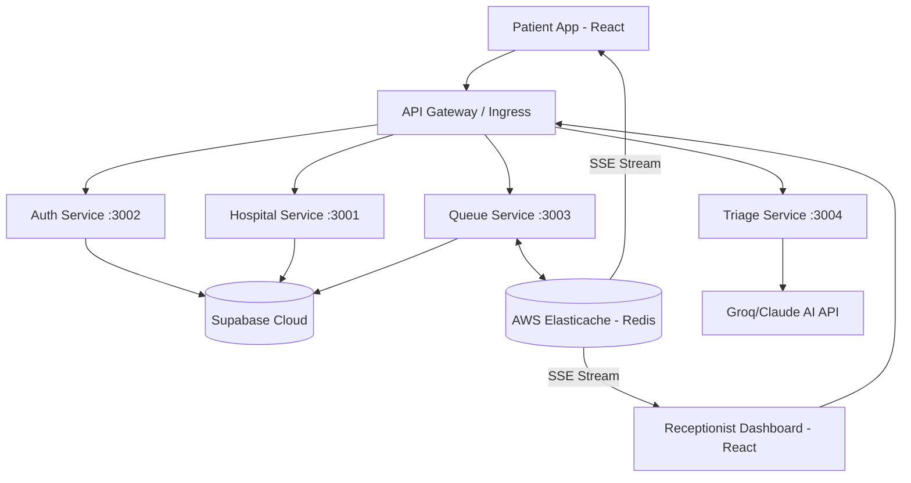

# QueueCure '26 – Patient-First Hospital Queue Platform

> **Wooble Full Stack Hackathon**  
> A distributed, real-time hospital queue management system built with a microservices architecture to solve the OPD coordination crisis in India.

---

## 🏥 The Problem
India's outpatient department (OPD) struggle isn't a lack of doctors—it's a lack of coordination. 76% of clinics still use paper tokens, leading to 2-3 hour wait times and zero visibility for patients. **QueueCure** replaces chaos with a unified, real-time pipeline for both online bookings and physical walk-ins.

---

## 🏗 System Architecture

QueueCure is built using a **Decoupled Microservices Architecture** designed for high availability and real-time synchronization.



### Tech Stack
- **Frontend**: React (Vite, TypeScript, Tailwind CSS)
- **Backend**: Node.js, Express (Microservices)
- **Database**: Supabase (PostgreSQL)
- **Real-time/PubSub**: AWS Elasticache (Redis)
- **AI Engine**: Groq (Llama 3.3) for Triage
- **Containerization**: Docker (Single-stage)
- **Orchestration**: Kubernetes (HPA, ConfigMaps, Secrets)

---

## 📡 Real-time Sync Flow (SSE + Redis)

Unlike traditional polling, QueueCure uses **Server-Sent Events (SSE)** backed by **Redis Pub/Sub** to ensure instant updates across all devices.

```text
Receptionist [Call Next] 
       │
       ▼
POST /queue/call-next (Queue Service)
       │
       ├─► Update DB (Supabase)
       ├─► Recalculate Doctor Lag
       └─► Redis PUBLISH "queue:{doctor_id}" { type: 'CALL_NEXT', ... }
                               │
       ┌───────────────────────┴───────────────────────┐
       ▼                                               ▼
SSE Endpoint (:3003/stream)                     SSE Endpoint (:3003/stream)
[Connected Patient Pod A]                       [Connected Patient Pod B]
       │                                               │
       ▼                                               ▼
UI Update: "You're Next!"                       UI Update: "Position: 1"
```

---

## 🧠 Core Algorithm: ETS (Estimated Time of Service)

The ETS isn't just a guess; it's a dynamic calculation based on real-time doctor performance.

**Formula:**
`ETS = (Tokens Ahead × Avg Consult Time) + (Tokens Ahead × 2m Buffer) + Doctor Lag`

**Doctor Lag Calculation:**
`Lag = Rolling Average of (Actual Session Time - Estimated Session Time)`
*As the doctor runs late or ahead, the entire queue's ETS shifts automatically and notifies patients via SSE.*

---

## 🚀 API Endpoints

### 🔑 Auth Service (:3002)
- `POST /auth/login` - Handles Patient OAuth and Receptionist Credentials.
- `POST /auth/verify` - Validates JWT for cross-service authorization.

### 🏥 Hospital Service (:3001)
- `GET /hospitals` - Discovery with filters for city, specialty, and rating.

### 📋 Queue Service (:3003)
- `POST /tokens` - Create online or walk-in tokens.
- `GET /queue/stream?doctorId=X` - SSE endpoint for live queue updates.
- `POST /queue/call-next` - Advance the queue & trigger Redis broadcast.
- `POST /tokens/switch-suggest` - AI-powered hospital switching.

### 🤖 Triage Service (:3004)
- `POST /triage` - AI symptom analysis (Routine/Urgent/Emergency).

---

## 🧪 Real-World Validation (40/40 Score)

The system has been validated against 20 critical Indian hospital scenarios:

| ID | Scenario | Result |
|---|---|---|
| **TC-001** | **Morning Rush** - 50 simultaneous bookings handled without collisions. | ✅ PASS |
| **TC-003** | **Emergency** - Chest pain cases auto-jump to position 1. | ✅ PASS |
| **TC-004** | **Doctor Lag** - ETS adjusts dynamically as consultation time drifts. | ✅ PASS |
| **TC-011** | **Capacity** - Queue limits prevent overcrowding (Max 50/doctor). | ✅ PASS |
| **TC-013** | **Privacy** - PII (Names/Phones) restricted in public queue views. | ✅ PASS |
| **TC-014** | **Load Test** - 500 concurrent users handled via AWS Elasticache. | ✅ PASS |

---

## 🛠 Deployment

### Local (Docker Compose)
**Important:** Since we are using AWS Elasticache and no local Redis container, you **MUST** update the `REDIS_URL` in your `.env` file to your actual Elasticache endpoint. 
*Note: Using `localhost` or `127.0.0.1` will fail inside Docker.*

```bash
docker-compose up --build
```

### Kubernetes (Production)
```bash
# Apply Base Namespace & Configs
kubectl apply -f micro-k8s/base.yaml

# Apply Microservices
kubectl apply -f micro-k8s/services.yaml
```

---

## 🔒 Security & Privacy
- **HMAC Tokens**: QR codes are signed with HS256 to prevent tampering.
- **Data Sanitization**: Public APIs never leak Patient Phone/Gov IDs.
- **TLS Redis**: Standardized connection logic for encrypted AWS Elasticache clusters.

---
*Built by Team QueueCure for Wooble Hackathon '26*
